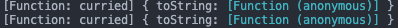

今天刚刚参加了字节跳动前端校招的第一轮面试，被问到了一道这样的题目：

```md
实现一个 add 函数，要求同一个函数能够实现两种调用的方法：
add(1, 2, 3, 4); // 10
add(1)(2)(3)(4); // 10
```

首先我们简化一下这个问题：如果函数只有两个以下的参数，我们要如何实现？

```javascript
function add(x, y) {
  if (typeof y !== "undefined") {
    return x + y;
  }
  return function(y) {
    return x + y;
  };
}
```

如果是不一定多少个参数传进来的话，首先我们是一定要用到`arguments`这个变量的。
其次，我们需要运用到闭包的概念将最终结果保存在一个闭包值内。但是如果保存在闭包值内的话，我们就无法返回这个值的同时返回函数本身实现柯里化。所以我们可以运用到重定义函数`toString`这个方法，将`toString`的返回值设置为我们闭包内存储的和，这样就实现了我们无限柯里化。

```javascript
function curriedAdd() {
  let _sum = 0;
  for (let i = 0; i < arguments.length; i++) {
    _sum += arguments[i];
  }
  function curried() {
    for (let i = 0; i < arguments.length; i++) {
      _sum += arguments[i];
    }
    return curried;
  }
  curried.toString = function() {
    return _sum;
  };
  return curried;
}

console.log(curriedAdd(1, 2, 3, 4, 5)); // 15
console.log(curriedAdd(1)(2)(3)(4, 5)(6, 7)(8)); // 36
```

这里除了柯里化的实现以外还有一个小的知识点可以记住：
Console 的 API 是没有一个统一实现标准的。在有些浏览器中，`console.log`如果传进的是一个对象，那么会自动对这个对象执行`toString()`。以上实现柯里化的方法就依赖于这一点。
但是，不是所有的浏览器（或者说 JS 运行时）都是这样实现`console.log`的。比如 NodeJS 就不会对对象执行`toString()`：



上述代码中的两个`console.log`取而代之的是会返回如上图中的结果，也就是两个描述函数对象的字符串，而并不是`toString()`返回的结果。
这次面试的时候就是被这一点坑了很久。以为自己实现错了，其实只是 NodeJS 不会隐式的对对象执行`toString`而已。
