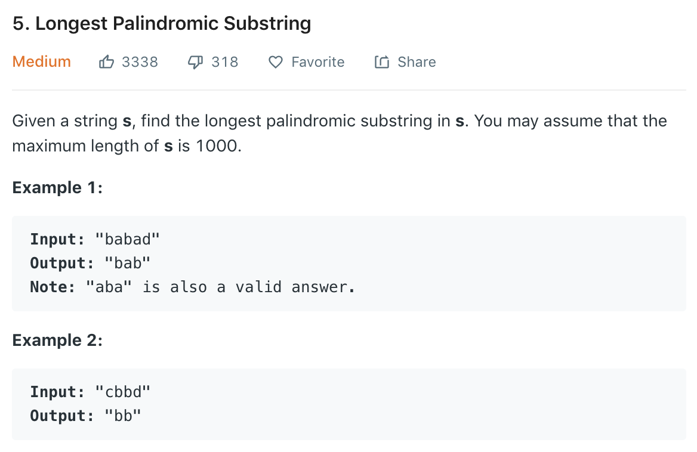

与之前做的上一题一样，此题也是一道难度为medium的题，个人认为比上一题要稍微难一些。
我们还是先来一起看一下题目描述：



### Solution 1: Brute Force Solution

看到这道题最先想到的当然就是暴力解法。遍历字符串中每一个字符，对每一个字符测试包含此字符的substring是否为palindrome。这个solution实现起来应该并不难，但是很显然此解法的时间复杂度为O($N^3$)，并不会是面试官想要的。

### Solution 2: Dynamic Programming

这题其实有一个特别简单的思路来实现recursion的解题。
我们假设$S_{i,j}$为从index i到j的一个substring，那么$S_{i,j}$是一个palindromic substring的条件则为：

1. $S_{i-1,j-1}$ 为palindromic substring
2. $S_i == S_j$

不难看出，我们可以建立一个二维的memo来存储$S_{ij}$是否为一个palindromic substring，也就是动态规划。遍历完所有i与j之后，找到j-i最大的那一对i和j数值即可得出最长的substring是哪一个。这个方法的时间复杂度为O($N^2$)，空间复杂度同样为O($N^2$)。

### Solution 3: Expand Around Center

除了dynamic programming之外，还有一种方式可以达到使用constant space就能解题。思路和动态规划相似，为了满足两个条件，我们可以从一个string的中间开始向两侧延伸，如果延伸的两个字符相同，那么我们就继续延伸，依次对每一个字符串中的字符做相同的操作。可以想象的是，因为我们要对每一个字符进行延伸，且延伸动作的最坏情况是延伸整个字符串，所以这个方法的时间复杂度同样为O($N^2$),然而空间复杂度被缩小到了O(1)。
让我们来看一下这个算法在Go语言中的实现：
```go
var low, maxlen int = 0, 0
func longestPalindrome(s string) string {
    charArray := []rune(s)
    length := len(charArray)
    if length < 2 {
        return s
    }
    for i := 1; i < length - 1; i++ {
        extendPalindrome(charArray, i, i)
        extendPalindrome(charArray, i, i + 1)
    }
    return string(charArray[low:low+maxlen])
}

func extendPalindrome(charArray []rune, j, k int) {
    for (j > 0 && k < len(charArray) && charArray[j] == charArray[k]) {
        j--
        k++
    }
    if maxlen < k - j - 1 {
        low = j + 1
        maxlen = k - j - 1
    }
}
```

1. 首先我们检查边界条件。如果长度小于2的话，我们直接返回原字符串。
2. 一个for loop来遍历每一个字符。这里注意的是，我们从第二个字符开始一直遍历到倒数第二个字符防止边界溢出。
3. 一个`extnendPalindrome`函数来延伸我们的子字符串。如果延伸的两个字符相等，我们更新j和k两个index的数值来进行延伸，直到`s[j]`和`s[k]`不相等为止。
4. 最后，我们根据延伸完后的j和k数值来更新子字符串起始位置，以及最长子字符串的长度。
5. `extendPalindrome`在loop中被调用了两次，原因在于我们既要考虑奇数长度的字符串，也要考虑偶数长度的。

### 总结
这一道题是一道相对简单的动态规划题目。如果能最初能想到递归的解法，那么不难再进一步想到2d 动态规划。因为recursion和动态规划是我的弱项，所以自己做的时候还是用了很久的时间。希望以后再接再厉。