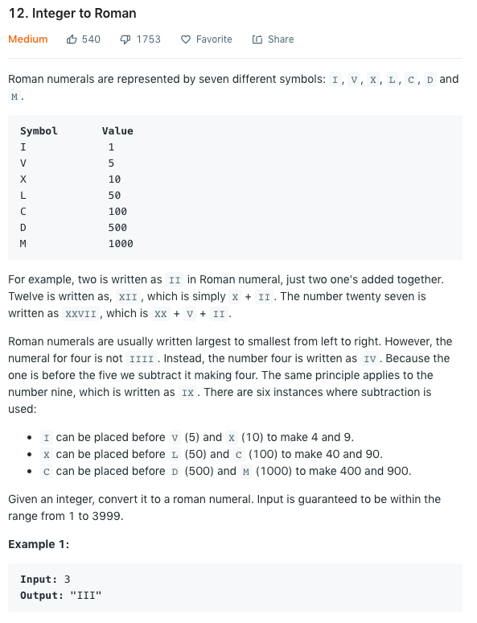

### Integer to Roman
国际惯例，我们先来看一下题目描述：



不难看出这题的思路完全是简单的一批，甚至说是不用什么思路就能做出来。。唯一需要多考虑一点的
corner case就是4和9这种需要加前缀的罗马数字需要区分考虑就可以了。
我们来看一下这题在c++中的实现：
```cpp
class Solution {
public:
    string intToRoman(int num) {
        string res = "";
        if (num == 0) return res;
        while (num >= 1000) {
            res += "M";
            num -= 1000;
        }
        if (num >= 900) {
            res += "CM";
            num -= 900;
        } else if (num >= 500) {
            res += "D";
            num -= 500;
        } else if (num >= 400) {
            res += "CD";
            num -= 400;
        }
        
        while (num >= 100) {
            res += "C";
            num -= 100;
        }
        if (num >= 90) {
            res += "XC";
            num -= 90;
        } else if (num >= 50) {
            res += "L";
            num -= 50;
        } else if (num >= 40) {
            res += "XL";
            num -= 40;
        } 
        
        while (num >= 10) {
            res += "X";
            num -= 10;
        }
        if (num == 9) {
            res += "IX";
            num -= 9;
        } else if (num >= 5) {
            res += "V";
            num -= 5;
        } else if (num == 4) {
            res += "IV";
            num -= 4;
        }
        while (num > 0) {
            res += "I";
            num -= 1;
        }
        return res;
    }
};
```

如上所示，基本就是从头到尾的考虑每一个罗马数字，然后依次从最高递减到最低就可以了。我第一次提交
没有过是因为自己没有考虑有一个边界条件是，当数字的大小刚好符合每一个if check的时候，也是要用
条件内的罗马数字表示的。也就是说每一个if的条件都是大于等于，而不仅仅是大于。

### Roman to Integer
这道题还有一个亲弟弟叫Roman to Integer是leetcode的第13题，也就是下一题。题目完全就是上一题
的反运算，所以就不放题目描述了。这题被标成了easy，而上一题标成了medium。个人感觉这一题稍微比
上一题难想那么一丢丢，不过都很简单就是了。这题我做的比较早，当时想找前端开发方向的工作所以
是用JS写的，那么我们先来看一下JS的解法：

```javascript
/**
 * @param {string} s
 * @return {number}
 */
var romanToInt = function(s) {
  var table = {
    'I': 1,
    'V': 5,
    'X': 10,
    'L': 50,
    'C': 100,
    'D': 500,
    'M': 1000
  }
  let number, nextNumber, result=0;
  for (let i=0; i<s.length; i++) {
    number = table[s[i]];
    nextNumber = table[s[i+1]] || 0;
    result += number < nextNumber ? -number : number;
  }
  return result;
};
```

不熟悉JS的同学对这个解应该也不会觉得太难理解。这里先建立一个hash table (JS中就是一个object)
来记录每一个Roman Numeral的数值，然后一个for loop来循环string中的每一个Roman Numeral。
如果当前数值小于下一个数值的话，就要减去当前数值而不是加上。这个逻辑应该也很好理解。
如果使用c++或者java的话，只需要把js的object换成hashmap就可以了。

###总结
从之前一直用的go换成了c++主要还是因为这两天吃了面试的亏，感觉国内面试主要还是以c++和java为主，
用小众语言真的是一点也不吃香，所以索性还是系统性的学一下c++比较好。之后的刷题应该也是以c++为主了。

