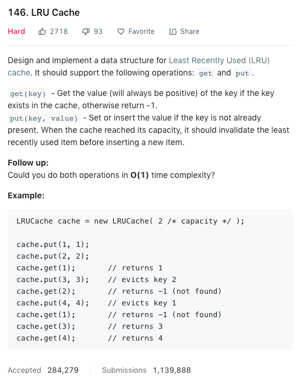

我们先来看一下题目描述：



学过计算机系统的同学应该都对LRU Cache不陌生，其实他就是一种数据结构来用有限的空间存储最近被使用的key value pairs，并达到constant time的get和put。

假设我们LRU Cache的capacity为2，那么我们最多只能存两个pairs。如果尝试存入第三个pair，那么第一个存入的pair就会被删除。所以我们在加入第三个pair之后
如果再尝试get第一个key的话， 应该return -1。

这道题的最终目标是为了让我们达到$O(1)$的get和put。

我个人认为这道题的难点在于设计，其次是实现。如果脑海中有了如何设计的大概思路，再加上熟悉使用的语言的基本包的话，其实写起来不是特别的难。而我在做这道题的时候，
两者都不具备。。。想不出来怎么设计，也不知道C++中如何更好地实现这个数据结构。说多了都是泪。

废话不多说，那么我们这道题的思路是什么？首先我们想要达到key value pairs的constant time get，马上想到的就是我们需要一个hash table来存储这个key value pairs。
但是仅仅有一个hash table显然是不够的（如果够了的话这道题也不用考了。。），我们还需要一个数据结构来存储我们最近用过和最少用的pairs都是哪些。如果达到了我们的capacity
上限，那我们就需要有一个方式来删除我们最不常用的那个pair。听上去是不是很像一个队列呢？没错，其实这个functionality我们就可以用一个queue来实现。在我们get一个key的时候，
我们需要把这个key value pair放到我们的queue最后边来代表我们刚刚使用过这个queue；在我们capacity超出上限需要删除时，我们只需要把queue的头删除即可。虽然概念是一个queue，
但其实实现起来为了达到$O(1)$的时间复杂度的话，我们在向队列头插入时想要达到constant time，就要使用一个链表来达成。有了思路以后，我们来一步一步的完成这个数据结构。

1. 我们先来看一下我们LRU Cache的成员变量都有什么：

```cpp
class LRUCache {
private:
    int capacity;
    list<pair<int, int>> cache;
    unordered_map<int, list<pair<int, int>>::iterator> m;
}
```

我们需要一个`capacity`成员变量来存储我们LRUCache的大小，一个双向链表来存储我们的key values pairs，以及一个hash table存储key到链表node的mapping。

```cpp
int get(int key) {
    const auto it = this->m.find(key); /* trying to see if the pair is in the cache */
    
    if (it == this->m.cend()) return -1; /* key is not in the cache */
    this->cache.splice(this->cache.begin(), this->cache, it->second);
    return it->second->second;
}
```

接下来我们来看一下怎么实现get。整体来说思路比较简单，我们先check这个key是否在我们的cache中。如果不在的话我们直接return -1即可。反之，我们先把这个node
放到我们cache的最前端，然后再return这个node的value即可。

```cpp
void put(int key, int value) {
    const auto it = this->m.find(key); /* whether it has the key or not */
    
    if (it != this->m.cend()) {
        it->second->second = value;
        this->get(key);
        return;
    } 
    if (this->cache.size() == this->capacity) {
        const auto& node = cache.back();
        this->m.erase(node.first);
        this->cache.pop_back();
    }
    this->cache.emplace_front(key, value);
    m[key] = this->cache.begin();
}
```

put在实现起来稍微复杂一点点，因为需要考虑一两个edge cases。首先第一步和get一样，我们先要确定放入的key是否已经存在于cache当中。如果存在的话，我们需要update旧的
value pairs，然后将之放到我们cache的最前端。这一步的逻辑和get是一样的。

其次，如果我们没有找到key，那么就说明给定的是一个新的key value pair。我们需要做的是先check目前cache的长度是否已经和capacity相等。如果是，那么我们需要先删除
cache最后的node，然后再把新的node加到cache的最前端即可。最终，不要忘记把hash table的key map到cache的头部。

### 总结
其实对于我来说，这道题最难的地方还是在C++中的实现。。尤其是为什么我们要把双向链表初始化为a list of pair of ints，而不是单纯的list of ints。这样做的目的是因为，
我们在put时需要达到$O(1)$的时间复杂度，那么我们在删除最后的key value pairs是也需要达到$O(1)$。如果我们只存储value，在对hash table做删除操作时就不能达到$O(1)$了。这个一开始对于我来说还是挺难理解的。