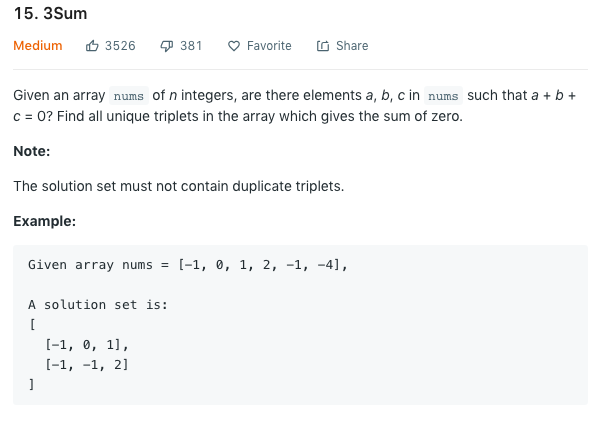

这是一道被Leetcode标为Medium的题目，让我们先来看一下题目描述：



这道题的点赞之多也是把我吓到了。。

其实看到这个名字就不难想到，这题应该就只是一个2Sum的升级版而已，所以我们的思路
也可用从解决2Sum开始，然后看看怎么再进一步解决3Sum。
大家都知道2Sum的最经典的解决方法就是2 Pointers了。除此之外的另一个解法是，
如果given list中不存在duplicate values，那我们可以将所有的element放入一个HashSet中，
这样就可以使找value的时间复杂度降低为O(1)。不过这一题当然不是这种情况啦。

我们先从brute force想起，找到一个给定数组中是否存在三个数字使得他们的和为0，那么很显然
这是一个用O($N^3$)时间复杂度可以解决的问题。但是很明显的是面试官肯定不会想要你这样的答案。。
那么我们可以从什么角度进行优化呢？
正如如上所提到的，我们可以将这个问题简化为2Sum。2 Pointers的第一步当然就是给这个数组排序，
然后再进行依次查找。所以我们的大框架是一个for loop来遍历整个数组，而在每一次循环之内都寻找
一对数字来使得当前数字以及这一对数字的和为0。有了这个思路以后，整个问题的代码应该就很明显了。
我们来看一下这题在C++中的实现：
```cpp
class Solution {
public:
    vector<vector<int>> threeSum(vector<int>& nums) {
        const int n = nums.size();
        vector<vector<int>> res;
        if (n < 3) {
            return res;
        }
        sort(nums.begin(), nums.end());
        for (int i = 0; i < n; ++i) {
            int low = i + 1; 
            int high = n - 1;
            while (low < high) {
                int sum = nums[low] + nums[high] + nums[i];
                if (sum == 0) {
                    vector<int> v {nums[low], nums[high], nums[i]};
                    res.push_back(v);
                    int lowValue = nums[low];
                    while (low < n && nums[low] == lowValue) {
                        ++low;
                    }
                    int highValue = nums[high];
                    while (high > low && nums[high] == highValue) {
                        --high;
                    }
                } else if (sum > 0) {
                    --high;
                } else {
                    ++low;
                }
            }
            while (i + 1 < n && nums[i] == nums[i + 1]) {
                ++i;
            }
        }
        return res;
    }
};
```

整体代码应该并不难理解，但是有一个需要注意的地方：

这一题的要求是，最终solution set中的每一个triplets都不能与其他triplets重复，那我们要
如何实现这个要求呢？因为我们的数组是进行过排序的，所以我们只要在移动三个pointers的时候，
跳过下一个与目前数值重复的数值就可以了。这一步在如上代码中的三个while loop里实现。

这个解法的时间复杂度为O($NlogN + N^2$) = O(N^2)，空间复杂度为O(1)（当然是在不考虑最终解的数组情况下）。


### 总结
这题如果做过2Sum并理解各种算法的话，做起来应该是没什么问题的。如果能想到2 pointers，那么第一步
一定是将数组排序，然后分别向数组中间移动。
