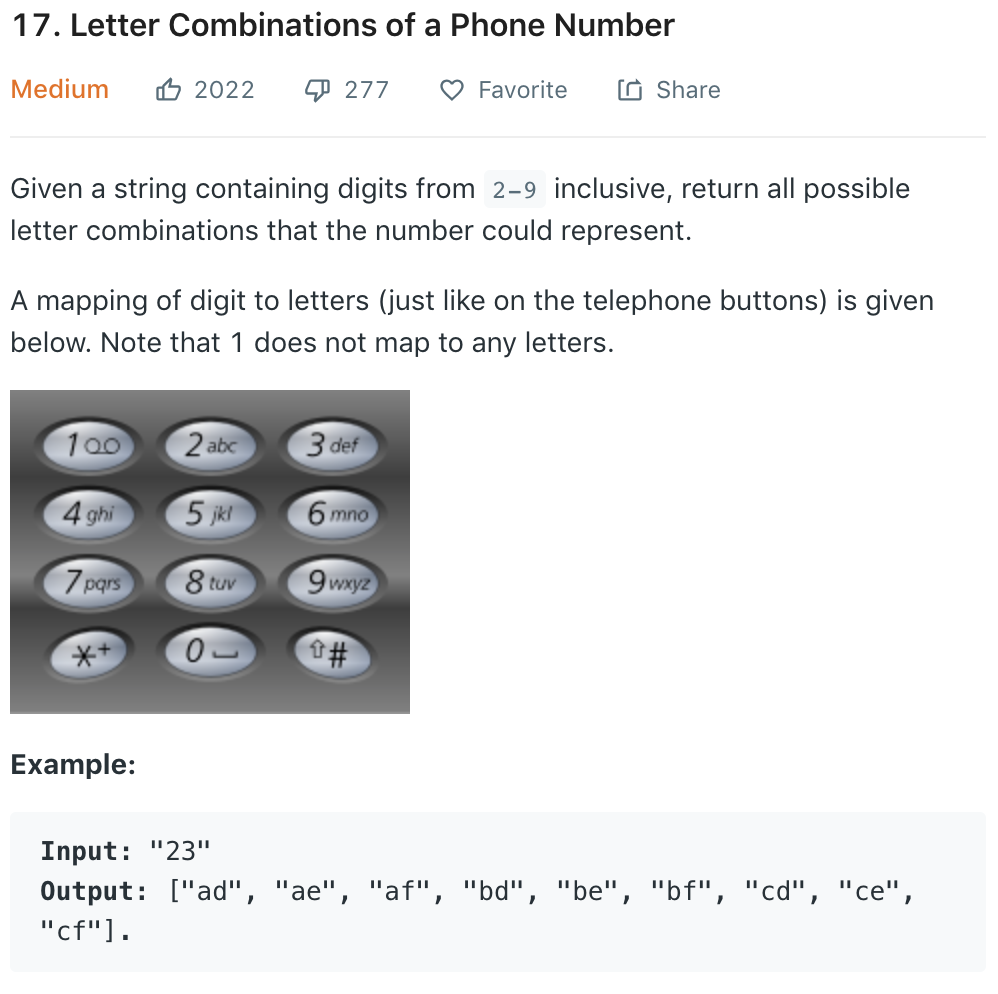
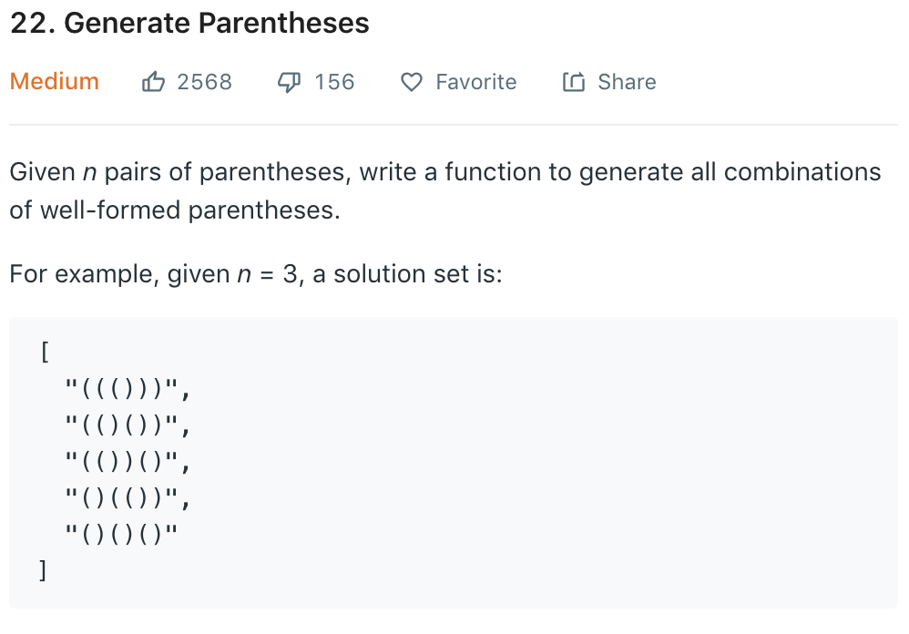

### Letter Combinations of a Phone Number

这是我最近做的两道很经典的DFS题目。我们先来看一下第17题的题目描述：



不难看出这是一道搜索题目，我们也可以用DFS以及BFS两种解法来对此题求解。我们先来看一下DFS的解法：

```cpp
class Solution {
public:
    vector<string> letterCombinations(string digits) {
        if (digits.empty()) reutrn {};
        vector< vector<char> > d(10);
        d[0] = {' '};
        d[1] = {};
        d[2] = {'a','b','c'};
        d[3] = {'d','e','f'};
        d[4] = {'g','h','i'};
        d[5] = {'j','k','l'};
        d[6] = {'m','n','o'};
        d[7] = {'p','q','r','s'};
        d[8] = {'t','u','v'};
        d[9] = {'w','x','y','z'};
        string current;
        vector<string> ans;
        dfs(digits, d, 0, current, ans);
        return ans;
    }

private:
    void dfs(const string& digits, const vector< vector<char> >& d, int l, 
             string& current, vector<string>& ans) {
        if (l == digits.length()) {
            ans.push_back(current);
            return;
        }
        for (const char c : d[digits[l] - '0']) {
            current.push_back(c);
            dfs(digits, d, l + 1, current, ans);
            current.pop_back();
        }
    }
}
```

主要关注一下dfs的signature：
1. `digits`：我们问题的input，需要与`l`结合来确定我们目前搜索的深度。
2. `d`： 单个digit到字母的map。
3. `l`：目前搜索的深度。当`l == digits.length()`时return。
4. `current`： 目前的string，搜到底部时将`current`附加到`ans`里。
5. `ans`:最终解。

有几个需要注意的C++的点：
1. `current`是作为reference pass给dfs function的
2. C++的string支持push_back和pop_back。我们dfs递归的栈其实就是`current`，所以直接使用这两个
方法非常的方便。需要注意的是，string的push_back的argument是char。

这个答案是在网上摘抄的，觉得写得很简单易懂。之后的所有dfs都可以按照这个模板来写。
再来看一下我在做这题时第一时间想到的一个bfs方法：

```cpp
class Solution {
public:
    vector<string> letterCombinations(string digits) {
        unordered_map< char, vector<string> > dictionary;
        dictionary['2'] = vector<string> {"a","b","c"};
        dictionary['3'] = vector<string> {"d","e","f"};
        dictionary['4'] = vector<string> {"g","h","i"};
        dictionary['5'] = vector<string> {"j","k","l"};
        dictionary['6'] = vector<string> {"m","n","o"};
        dictionary['7'] = vector<string> {"p","q","r","s"};
        dictionary['8'] = vector<string> {"t","u","v"};
        dictionary['9'] = vector<string> {"w","x","y","z"};
        vector<string> result;
        char firstDigit = *digits.begin();
        for (auto c : dictionary[firstDigit]) 
            result.push_back(c);
        for (auto it = digits.begin() + 1; it < digits.end(); ++it) {
            vector<string> newResult;
            for (auto c : result) 
                for (auto nextC : dictionary[*it])
                    newResult.push_back(c + nextC);
            result = newResult;
        }
        return result;
    }
};
```

这题的bfs方法比dfs要多出一些小缺点：
1. 首先我自己写的有一个问题，就是用了hash table而不是一个简单的二维数组，使得空间上稍微有了一些不efficient，不过这个是很好修改的小问题。
2. 这个方法需要建立两个滚动数组来记录上一个深度的结果，以及目前深度的结果，也使得空间上没有dfs efficient。

总体来说这是一道相当经典的搜索题目，也给我稍微带来了一点搜索类题目的启发。

### Generate Parentheses

题目描述如下：



不难看出，其实这题的思路和上一道题是一样的，只不过在做dfs的时候不像上一题一般的简单，需要考虑一些edge cases。
与上题最大的不同就是，我们在做进一步搜索时，需要考虑下一步搜索都可以搜到哪些节点。也就是说，我们需要考虑目前状态下
有多少个打开的括号，以及还剩余多少对括号没有进行闭合。如果有这个思路的话，那么理所应当的我们的dfs递归的parameters
里边就要take in目前有多少对打开的括号`open`，以及未搜索的括号数`n`。如果目前`n`的数量大于`open`,那么我们就可以
继续搜索开括号`'('`。之后，如果目前`open`的数量大于0，那我们就可以继续搜索闭括号`')'`。如果`n`等于0，说明所有的
括号都是打开状态了，那么我们写一个for循环来循环`open`次，将闭括号放到目前的解上并return。我们来看一下这个算法在
C++中的实现：

```cpp
class Solution {
public:
    vector<string> generateParenthesis(int n) {
        /* dfs */
        if (n == 0) return {};
        vector<string> ans;
        string current = "";
        int open = 0;
        dfs(open, n, current, ans);
        return ans;
    }

private:
    void dfs(int open, int n, string& current, vector<string>& ans) {
        if (n == 0) {
            for (int i = 0; i < open; ++i) {
                current.push_back(')');
            }
            ans.push_back(current);
            return;
        }
        if (n > open) {
            current.push_back('(');
            dfs(open + 1, n, current, ans);
            current.pop_back();
        }
        if (open > 0) {
            current.push_back(')');
            dfs(open - 1, n - 1, current, ans);
            current.pop_back();
        }
    }
};
```

### 总结
之前真的很少做graph和tree类题目，尤其是涉及搜索的题目。这两道题算是很简单的搜索题目了，对之后
做同类题目起一个抛砖引玉的效果吧。写DFS还是需要注意return的base case。


