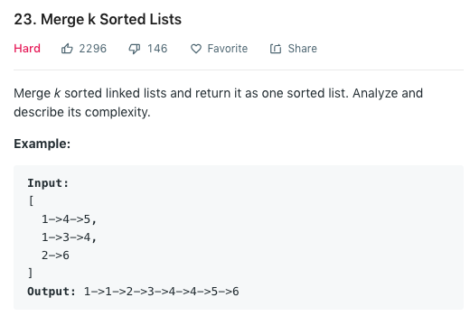

国际惯例，让我们先来看一下题目：



乍一看这道题，相信稍微对数据结构和算法有了解的同学就能看出这道题目的这个算法很像merge sort的实现方法。
如果我们给定两个sorted list，那么我们只需要两个pointers指向每一个list的头，然后依次将小的那一个node
插入到我们最终return的list里就可以了。当然，不要忘了increment我们的指针。

那我们在有这个思路的情况下，如何generalize我们的算法呢？如果我们的k=2，也就是上文所描述的情况，那每一次循环
做比较时只需比较两个lists当前的node即可。然而，如果k>2，那么暴力解法的话，我们每次比较就需要O(k)的时间。
我们对所有lists的当前节点做循环，找出最小的那一个节点，把他连到我们的最终list上。这样的算法的时间复杂度为$O(Nk)$，
因为我们对每一个node遍历一次的情况下，对每个list的当前node也要遍历一次找出最小值。我们来看一下暴力解法在C++中的实现：

```cpp
/**
 * Definition for singly-linked list.
 * struct ListNode {
 *     int val;
 *     ListNode *next;
 *     ListNode(int x) : val(x), next(NULL) {}
 * };
 */
class Solution {
public:
    ListNode* mergeKLists(vector<ListNode*>& lists) {
        ListNode dummy(0);
        ListNode* tail = &dummy;
        while (1) {
            bool finished = true;
            ListNode smallest(INT_MAX);
            for (ListNode* head : lists) {
                if (head) {
                    finished = false;
                    if (smallest.val > head->val) {
                        smallest = *head;
                    }
                }
            }
            tail->next = &smallest;
            smallest = *smallest.next;
            tail = tail->next;
            if (finished) break;
        }
        return dummy.next;
    }
};
```

这个解法应该是大家最开始就能想到的，然而我在提交的时候超时了。。并没有给过。那么我们能否想到任何的方法来优化我们
目前的算法呢？

首先，我们的暴力解法的时间复杂度为$O(Nk)$。这里我们知道，复杂度中的$N$项其实是无法进行优化的，因为我们至少要遍历
每一个节点一次。那么我们就应该从$k$上下手。脑海中迅速闪过所有的数据结构，不难想到其实如果建立一个heap(priority queue)来
帮助我们存储目前指针指向的k个节点，我们就可以很轻松的将最小的节点取出，并将这个运算的时间复杂度从$O(k)$降低到了$O(logk)$。

整个算法的思路如下：
1. 我们先将每一个list的头放入一个priority queue中。此运算的时间复杂度为$O(N)$ （建立堆的时间复杂度为$O(N)$。
2. 只要我们的priority queue不为空，我们就将它的头取出，并连到我们的结果上。将被挪的那个指针移向下一个节点，并将其再次插入priority queue中。这一步的时间复杂度为$O(Nlogk)$。

有了思路以后，我们再来看一下C++的实现：

```cpp
class Solution {
public:
    ListNode* mergeKLists(vector<ListNode*>& lists) {
        ListNode dummy(0);
        ListNode* tail = &dummy;
        auto comparator = [](ListNode* a, ListNode* b) { return a->val > b->val; }; /* minheap */
        priority_queue<ListNode*, vector<ListNode*>, decltype(comparator)> pq(comparator);
        for (ListNode* head : lists)
            if (head) pq.push(head);
        while (!pq.empty()) {
            tail->next = pq.top();
            pq.pop();
            tail = tail->next;
            if (tail->next) pq.push(tail->next);
        }
        return dummy.next;
    }
};
```

细节上应该也不难理解。这里也是学习了一下C++中priority queue的使用方法。注意的是第六行我们建立了一个名为`comparator`的lambda function，这个是在我们使用priority queue api的时候C++调用的比较函数。如果我们想construct一个min heap的话，这里return的应该是第一个argument大于第二个argument。lambda function是一个C++11新添加的特性。

### 总结
做这一道题主要是帮助自己整理了一下面试的时候approach一个问题的思路。先从简化问题开始(从merge k简化到merge 2)，再想怎么generalize简化过的问题，想出一个brute force solution，最后再从brute force作为起点做优化。
除此之外，这道题也让我学习到了c++的priority queue api，其实还是相当好用的。原本准备自己写一个heap，但是发现c++自带的这个heap这么好用就没有自己写。但是有一个问题没有解决，就是如果k的值非常大的话，在我的答案中是先建立了一个空的priority queue然后再一个一个把头插入到pq中，这一步的worse case是$O(klogk)$。我们知道其实建立一个priority queue其实是可以达到$\Theta(N)$的，但是无奈我不知道该如何在initialize comparator的前提下还能初始化一个带数值的pq。希望有同学知道的话可以下下方评论告诉我。