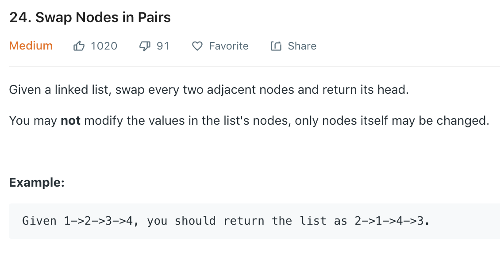

这是一道leetcode中等难度的题目。题目描述如下：



这题虽然标的是medium，其实思路非常的简单，不过实现起来稍微有一点tricky。
对每两个节点进行pair-wise交换，只需要建立一个temp pointer
指向第三个node，交换前两个，再从第三个node开始即可。

此题很显然可以使用iterative与recursive两种方法来解题。

### Iterative  
先来看一下iterative的做法：

```go
/**
 * Definition for singly-linked list.
 * type ListNode struct {
 *     Val int
 *     Next *ListNode
 * }
 */
func swapPairs(head *ListNode) *ListNode {
    if head == nil || head.Next == nil {
        return head
    }
    dummy := new(ListNode)
    previous := new(ListNode)
    dummy = previous
    previous.Next = head
    for previous.Next != nil && previous.Next.Next != nil {
        a := previous.Next
        b := a.Next
        previous.Next, b.Next, a.Next = b, a, b.Next
        previous = a
    }
    return dummy.Next
}
```
看上去很简单的逻辑其实暗藏很多玄机。
1. 首先在第2行check最明显的两个边界条件： `head`和`head.Next`是否为`nil`。
2. 建立一个`dummy` node来保存原始的`head` pointer。
3. 这里再建立一个`previous` node来保存上一次交换后的第二个node。原因在于，交换两个node之后
需要更新之前一次交换后第二个node的`Next` pointer。
4. 这里最需要注意的是第12行。这里用到了Go语言类似于Python swap values的一个功能来直接同时
改变三个变量的values。如果这一行有困难理解的话，
一个比较有用的Stack Overflow回答可以在[这里](https://stackoverflow.com/questions/35707222/swap-two-numbers-golang)找到。

这题的runtime complexity为O(N)。

### Recursive
看完iterative解法以后，我们再来看一下recursive的解法。

```go
func swapPairs(head *ListNode) *ListNode {
    if head == nil || head.Next == nil {
        return head
    }
    first, second, third := head, head.Next, head.Next.Next
    second.Next = first
    first.Next = swapPairs(third)
    
    return second;
}
```

使用递归的解法看上去就简单易懂了很多。
1. 首先第一步还是check边界条件
2. 初始化三个node分别代表需要调换的两个node，以及调换之后的下一个node(list)。调换前两个node之后，recursively调换第三个node(list)。

与iterative一样，runtime complexity为O(N)。然而对于所有的recursion解法都需要有一定的space complexity，大小与递归树成正比。因此，此解法的space complexity一样为O(N)。

## 总结
总体来说这一道题难度还是中等偏下，但是我在做的时候花了很久才把iterative solution的调换部分搞明白。对于使用python和go的同学来说，有swap values的功能对于linkedlist类型的题还是比较好用的。使用C++，Java等语言的话，写起来可能会相对吃力一些。