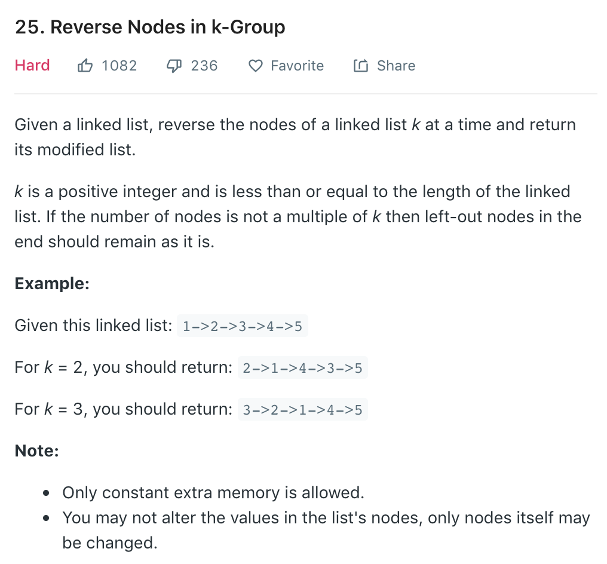
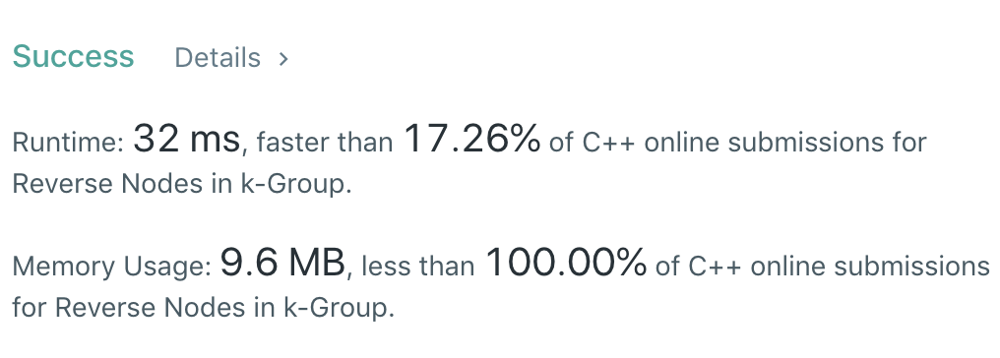
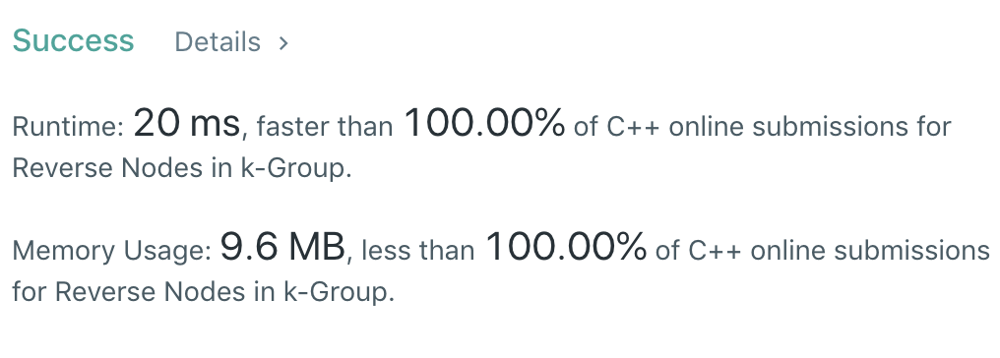

被一个course project搞的生活不能自理，因此有一段时间没有更新博客了。这道题其实在几天之前我就开始想怎么做了，写了一个方法时间没有跑过，不知道是自己写错了还是算法的思想有问题就去看了看答案，发现自己想的没问题，应该就是写错了。。

我们先来看一下题目描述：



一道经典的reverse linkedlist类型题目。分组来reverse其中一部分的nodes，这道题其实有两种实现方法：iterative和recursive。
iterative的话，我们需要得到linkedlist的长度，然后对每k个节点做reverse即可。这个方法需要two pass，因为我们第一个pass要得到linkedlist的长度，然后再做循环。Runtime是$O(2N)=O(N)$，Space是$O(1)$。recursive的解法个人感觉相对更好理解一下，我们reverse前k个nodes，然后再recursively reverse剩余的node就可以了。这个方法只需要one pass，虽然Runtime依然是$O(N)$，但是显然是比第一个方法要快很多的。Space是$O(K)=O(1)$。

先来看一下C++ iterative的解法：

```cpp
/**
 * Definition for singly-linked list.
 * struct ListNode {
 *     int val;
 *     ListNode *next;
 *     ListNode(int x) : val(x), next(NULL) {}
 * };
 */
class Solution {
public:
    ListNode* reverseKGroup(ListNode* head, int k) {
        if (!head || k == 1) return head;
        ListNode dummy(0);
        dummy.next = head;
        int length = 1;
        while (head = head->next) ++length;
        ListNode* prev = &dummy;
        for (int l = 0; l + k <= length; l += k) {
            ListNode* current = prev->next;
            ListNode* nxt = current->next;
            for (int i = 1; i < k; ++i) {
                current->next = nxt->next;
                nxt->next = prev->next;
                prev->next = nxt;
                nxt = current->next;
            }
            prev = current;
        }
        return dummy.next;
    }
};
```

个人认为比较难理解的地方内循环中reverse的地方。我们保留了三个指针分别指向`prev`, `current`和`nxt`。原因在于，我们reverse完k个节点以后需要知道我们目前的头在哪里，以及头的前一个节点在哪里。需要注意的是，`prev`和`current`这两个指针在内循环中是不变的。我们来举一个例子：

假如我们的input是一个这样的链表：1->2->3->4->5。假设k=3，那么我们最终的结果就应该是3->2->1->4->5。

我们首先需要一个dummy node来保存我们的输出头，所以dummy->next初始指向1，并作为我们最初的`prev`。我们最初的`current`为1，`nxt`为2。

在内循环的第一次循环中，我们想要达到的目标是调换1和2，使链表变为d->2->1->3->4->5。因此我们在第12行先将`current->next`指向`nxt->next`，也就是将1的next指向3。然后我们将`nxt->next`指向`prev->next`。这里需要注意的是，`prev->next`是不一定等于`current`的，因为我们`prev`指针永远指向`dummy`，这样才能保留我们最终reverse结束后的头部。可以这样理解：我们的最终目标是使`dummy->next`指向3，如果同时移动`prev`的话，就是pair-wise的reverse了，因此`prev`在一次小循环中是不应该变的。同样的，`current`在最初指向1，其实到最后我们做完reverse之后，`current`还是应该指向1，也就是长度为k的小链表的最后一个节点。唯一改变的是`nxt`，因为我们需要一直保存`current`的下一个节点。

想明白以后我们提交答案：



和预想之中差不多，虽然memory方面打败了100%，但是时间上并不是最优化的，只打败了17%。和之前提到的一样，因为这个算法需要two passes，所以时间上还是慢了一些。那么我们再来看一下recursive的解法：

```cpp
class Solution {
public:
    ListNode* reverseKGroup(ListNode* head, int k) {
        if (!head || k == 1) return head;
        ListNode* current = head;
        int l = 0;
        bool hasLengthK = false;
        while (current) {
            current = current->next;
            ++l;
            if (l == k) {
                hasLengthK = true;
                break;
            }
        }
        if (!hasLengthK) {
            return head;
        } else {
            ListNode dummy(0);
            dummy.next = head;
            ListNode* prev = &dummy;
            ListNode* nxt = head->next;
            for (int i = 1; i < k; ++i) {
                head->next = nxt->next;
                nxt->next = prev->next;
                prev->next = nxt;
                nxt = head->next;
            }
            head->next = reverseKGroup(nxt, k);
            return dummy.next;
        }
    }
};
```

reverse一段linkedlist的逻辑是和iterative solution一样的。我们第一步先check长度够不够k，如果不够的话直接return head即可；如果够的话，我们对k个node进行reverse，并recursively reverse之后的nodes。

提交以后的runtime和space如下：



无敌！收工。

