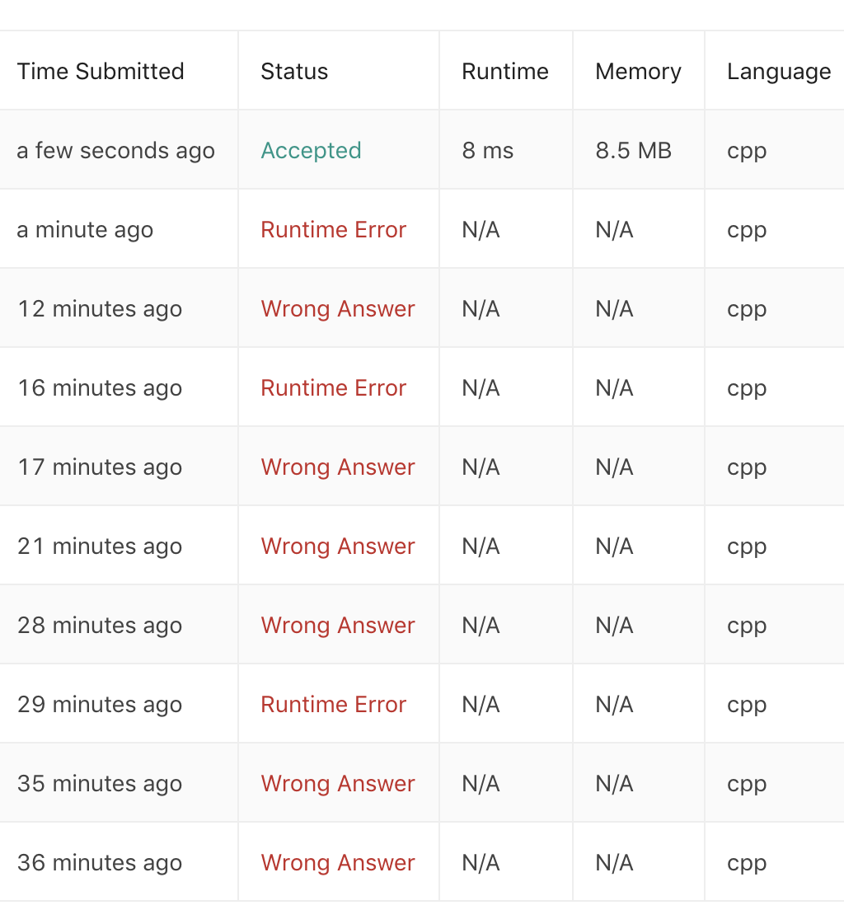
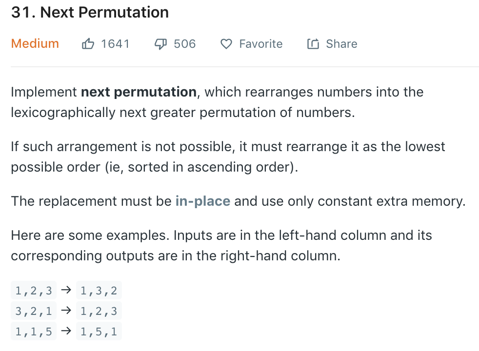

看题目描述之前先来观赏一下我的提交记录。。。。。。



最后实在是处理不懂edge cases了所以看了答案。真的是崩溃。疯狂下拉这个号的正确率。。。

我们来看一下题目描述：



在C++中有一个builtin就叫next_permutation，这题就是想让我们重新实现这个函数。

其实不难看出，这道题至少需要我们找出我们需要改变的第一个数字在哪里：比如我们的input是`1,3,2`，那么下一个需要改变的数字就是`1`，因为下一个lexicographical的permutation是`2,1,3`。那我们怎么定位到`1`呢？可以从数组的倒数第二个开始向前遍历，如果当前数字大于或者等于下一个数字，那我们就向前遍历一个数字，直到当前数字比下一个数字小为止。

找到上一个例子中的`1`以后，我们需要将这个元素与之后的其中一个元素交换。那么是哪一个数字呢？我之前想的是最后一个数字，但其实应该是在`1`之后刚刚好比`1`大的那个数字。比如我们的input数组是`5,4,7,5,3,2`，我们首先有一个`i` counter遍历至`4`，然后应该有一个`j` counter从末尾一直遍历到`5`，也就是第一个比`4`大的数字，然后将他们两个交换。最后，我们需要sort `i`之后的所有数字。这里我们发现，其实sort和reverse并没有任何区别，所以两者皆可。我们来看一下c++中这道题目的实现：

```cpp
class Solution {
public:
    void nextPermutation(vector<int>& nums) {
        int n = nums.size();
        int i = n - 2;
        while (i >= 0 && nums[i + 1] <= nums[i]) --i;
        if (i >= 0) {
            int j = n - 1;
            while (j >= 0 && nums[j] <= nums[i]) --j;
            swap(nums[i], nums[j]); 
        }
        sort(nums.begin() + i + 1, nums.end());
    }
};
```

最后的sort可以改成reverse。达到的效果是一样的，但是可能理论上reverse会更快一些（虽然leetcode提交以后runtime都是打败100%）。

### 总结

这道题真的是纠结了一辈子。。其实就只是最后有一点没想明白，就是其实在找到`i`以后，应该和`i`之后的数组中的第一个比`i`大的数字交换，而不是单纯的最后一个。因为这一点没想明白，导致走上了歪路，一直在解决解决不完的边界条件。。也是醉了。希望以后自己能稍微对这些边界条件敏感一些。