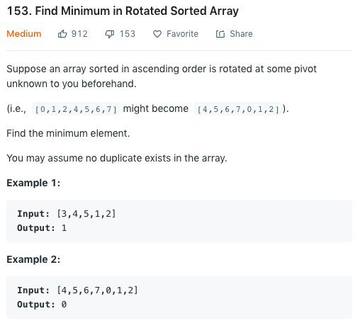
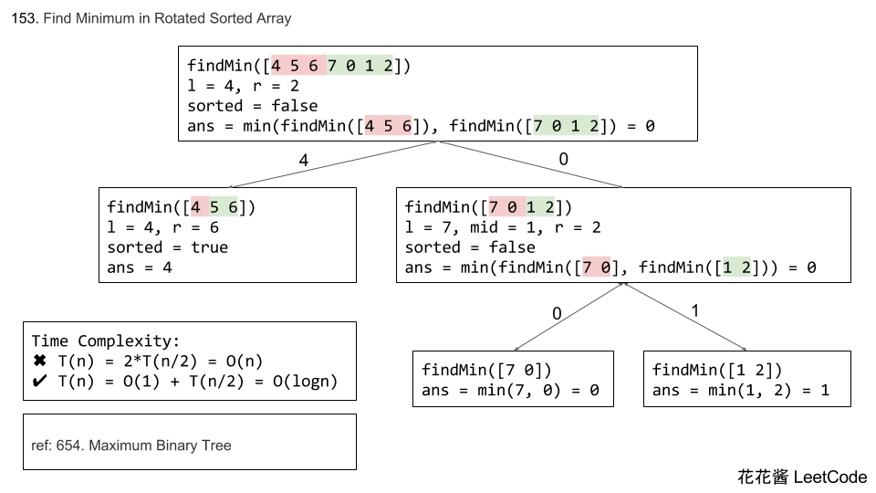
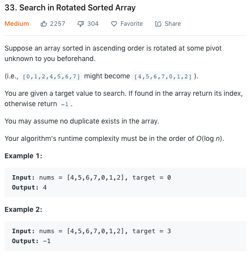

153算是一个33的弱化版。我们先来看一下153的题目描述：



我们给定一个旋转过的排序数组，题目让我们找到这个数组中的最小值。

首先最明显的一个算法就是我们从头开始遍历数组一直到尾，找到最小的即可。这样的时间复杂度是$O(N)$，显然不是面试官想要的。那我们如何才能优化线性时间呢？线性时间复杂度的下一级当然就是$O(logN)$了，那我们看到log时间复杂度第一想到的就是binary search。这题的条件其实也算稍微符合binary search的条件，那我们怎么才能将他运用到这道题里呢？

其实很简单，我们只需要搞清楚旋转排序数组的特性，这题就迎刃而解了。给定的例子中，我们有一个数组是`3,4,5,1,2`，那我们最小的值就是1。我们可以发现的是，在1之后这部分的子数组是有序的，1之前的这个子数组也是有序的。有了这个想法，那么我们只需要找一个分割点使得左右两个子数组都有序就可以了。注意这里有一点特殊情况是，如果本来整体数组是排好序的，那我们从任意一点分割，两边的数组都是排序的，这显然并不代表我们任意一个点都是minimum。所以我们在写此算法是需要第一个考虑到这个边界条件。

那么我们如何判断一个数组是否是排序的呢？其实我们只需要确保这个子数组的第一个元素是小于最后一个元素即可。我们可以将这个思路来generalize到binary search中：找一个中点`mid`，如果`mid`左边的子数组已排序而右数组未排序，那我们继续搜索右数组，反之亦然。如果左右数组都已排序，那我们就可以直接return `mid`。

我们来看一下算法在C++中的实现：

```cpp
class Solution {
public:
    int findMin(vector<int>& nums) {
        int n = nums.size();
        if (n == 1) 
            return nums[0];
        
        int left = 0, right = n - 1;
        if (nums[right] > nums[0]) 
            return nums[0];
        
        while (right > left) {
            int mid = left + (right - left) / 2;
            
            if (nums[mid] > nums[mid + 1])
                return nums[mid + 1];
            if (nums[mid - 1] > nums[mid])
                return nums[mid];
            if (nums[mid] > nums[0])
                left = mid;
            else 
                right = mid - 1;
        }
        return -1;
    }
};
```

以上算法使用iterative的解题思路。首先确认边界条件，然后进行binary search。前两个if确认当前`mid`是否为结果。这里注意的是我们有两种方式都可以确认我们已经找到了结果：如果`mid`大于`mid+1`，或者`mid-1`大于`mid`。这两个条件应该都不难理解。如果两个条件都不满足，我们依次进行二分搜索即可。

除了iterative的方法之外，我们还可以用recursive的方法来解决这个问题。在确认整体数组是否有序这个边界条件之后，我们还是先找到数组的中点然后确认左右两边是否排序，然后找未排序一边的最小值即可。已排序过的一边我们不需要找最小值，因为我们可以确认最小值一定在未排序的一边。有这个思路以后我们的代码其实就很简单明了了。这里引用一下花花对这道题的讲义截图，应该能帮助理解recursive的解法：



```cpp
// Author: Huahua
class Solution {
public:
    int findMin(vector<int> &num) {
        return findMin(num, 0, num.size()-1);
    }
    
private:
    int findMin(const vector<int>& num, int l, int r)
    {
        // Only 1 or 2 elements
        if (l+1 >= r) return min(num[l], num[r]);
        
        // Sorted
        if (num[l] < num[r]) return num[l];
        
        int mid = l + (r-l)/2; 
        
        return min(findMin(num, l, mid-1), 
                   findMin(num, mid, r));
    }
};
```

### LeetCode 33: Search in Rotated Sorted Array

看完了153我们再来看33。



这题和上一题类似，还是给定一个rotated sorted array，让我们在这样的一个array里做search。时间复杂度需要达到$O(logN)$，所以同样还是需要我们用到binary search。那我们如何approach这个问题呢？首先，如果我们有153这道题的思路的话，我们的第一步是可以找到这个旋转的pivot的index在哪里。假设我们的给定数组是`[4,5,6,7,0,1]`，我们用153的算法可以找到`0`，也就是pivot的index在哪里，然后我们可以进行一个判断，确定寻找的target是在哪一个用pivot分开的区间内，再在特定区间内进行binary search即可。我们来看一下实现：

```cpp
class Solution {
public:
    int search(vector<int>& nums, int target) {
        /* Do a binary search to find the pivot first,
        then do binary search on either of the two 
        separated part of the vector */
        if (nums.size() == 0) 
            return -1;
        if (nums.size() == 1) 
            return nums[0] == target ? 0 : -1;
        
        int pivot = findPivot(nums), result;
        if (pivot == 0) /* whole array is sorted */
            result = rangeBinarySearch(nums, 0, nums.size(), target);
        else if (nums[0] > target) /* second half is sorted */
            result = rangeBinarySearch(nums, pivot, nums.size(), target);
        else /* first half is sorted */
            result = rangeBinarySearch(nums, 0, pivot, target);
        
        return result;
    }

private:
    int findPivot(vector<int>& nums) {
        int left = 0, right = nums.size() - 1;
        if (nums[0] < nums[right]) return 0;
        while (left < right) {
            int mid = left + (right - left) / 2;
            if (nums[mid] > nums[mid + 1])
                return mid + 1;
            if (nums[mid] < nums[mid - 1])
                return mid;
            if (nums[mid] > nums[0])
                left = mid;
            else 
                right = mid - 1;
        }
        return -1;
    }

private:
    int rangeBinarySearch(vector<int>& nums, int begin, int end, int target) {
        while (begin < end) {
            int m = begin + (end - begin) / 2;
            if (nums[m] == target)
                return m;
            if (nums[m] > target)
                end = m;
            else
                begin = m + 1;
        }
        return -1;
    }
};
```

我自己写的时候出了很多边界条件的问题，写binary search的问题还是不太熟练。。需要多加练习。

### Generalized Binary Search Algorithm

所有的binary search题目都可以用以下模板来修改。我用的是一个左闭右开的方法，也就是和python中的list slicing类似。

```cpp
int binary_search(vector<int>& nums, int target) {
    int left = 0, right = nums.size();
    while (left < right) {
        int mid = left + (right - left) / 2;
        if (nums[mid] == target) 
            return mid;
        if (nums[mid] > target) 
            right = mid;
        else
            left = mid + 1;
    }
    return -1;
}
```