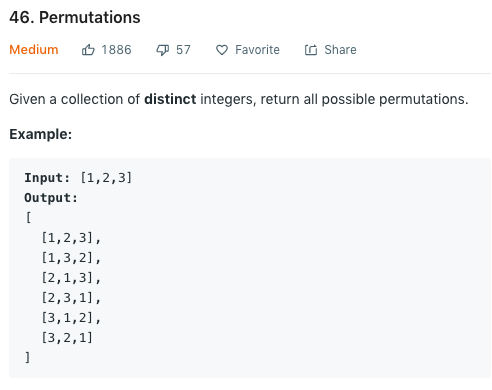

有好几天没有更新了，因为这两天考完Econ放松了一下再加上身体有点不舒服就没怎么做题。我们先来看一下题目描述：



和之前做过的一道[Next Permutation](https://oddguan.io/leetcode31/)有一点相似（回想起被支配的恐惧）。我这里的第一反应是以为这道题很简单。。采用dfs来进行逐层搜索，将依次的下一个元素push到当前数组里，然后将最终答案push到我们的result array中好像就可以了。这个想法显然是不对的：第一，我们当前数组的下一个元素不一定在最后一个元素之后。在给定例子中，`1,2,3`确实是原数组顺序依次push进当前数组的，然而其他数组并非如此。我们需要一种方法来记住我们目前已经使用过（没使用过）的数字都是哪些，然后再将任意一个未使用过的数字push进数组，再进行常规的dfs backtracking即可。我最初想到的记录未使用数字的方法是使用一个`set`，每次push一个数字后就将其踢出`set`，然后进行dfs，return后再将数字重新插回`set`即可。来看一下C++的实现：

```cpp
class Solution {
public:
    vector<vector<int>> permute(vector<int>& nums) {
        vector<vector<int>> result;
        unordered_set<int> unusedNums(nums.begin(), nums.end());
        for (int i = 0; i < nums.size(); ++i) {
            unusedNums.erase(nums[i]);
            vector<int> n{nums[i]};
            dfs(nums, result, n, unusedNums, 1);
            unusedNums.insert(nums[i]);
        }
        
        return result;
    }

private:
    void dfs(vector<int>& nums, vector<vector<int>>& result, vector<int>& n, unordered_set<int>& unusedNums, int level) {
        if (level == nums.size()) {
            result.push_back(n);
            return;
        }
        for (int i = 0; i < nums.size(); ++i) {
            if (unusedNums.find(nums[i]) != unusedNums.end()) {
                n.push_back(nums[i]);
                unusedNums.erase(nums[i]);
                dfs(nums, result, n, unusedNums, level + 1);
                unusedNums.insert(nums[i]);
                n.pop_back();
            }
        }
    }
};
```
我们来分析一下时间复杂度。首先给定一个长度为$N$的数组，一共有$N!$种permutation。我们在获得每一个permutation之前都要进行一段线性搜索来找到当前可以继续搜索的数字是哪一个，所以我们最终的runtime是$O(NN!)$。提交后时间打败了20%，显然是有很大的提升空间的。

我们知道既然长度为N的数组有$N!$个permutation，那我们时间复杂度的lower bound就一定是$N!$。那我们优化的角度就可以从线性搜索开始。我们现在的approach是使用一个`set`来记录所有未使用过的数字，每次dfs时进行一个线性搜索来寻找下一个可能的数字是哪一个，最终当level到底时return。如果我们有一个方法来使用当前数组来记录过未使用的元素，是不是就可以不用`set`了呢？

其实这里的idea很类似于insertion sort。我们假设给定数组的前半部分是已使用的所有数字，后半部分是未使用的数字，而中间的分割我们使用一个int来pass给dfs，这样我们就可以在当前数组内记录所有数字的状态了，我们来看一个小例子：

假设我们的input是`1,2,3`，我们从`1`开始进行第一层搜索。我们需要一个loop来循环`nums`中`1`之后的包括自己的所有数字，也就是`1`,`2`和`3`。我们将他们依次交换以后再递归dfs交换后的数组即可，level+1。举个例子，当第一层遍历到`2`时，我们先把`2`和`1`交换，使`2`变为第一个元素，然后再递归将`2`之后的`1`和`3`交换，这样就可以得到`2`开头的所有数组了。这个思路不是我自己想出来的，确实是值得学习，也不禁感叹自己的脑子确实是不如别人。。我们来看一下实现：

```cpp
class Solution {
public:
    vector<vector<int>> permute(vector<int>& nums) {
        vector<vector<int>> result;
        dfs(nums, result, 0);
        return result;
    }

private:
    void dfs(vector<int>& nums, vector<vector<int>>& result, int pos) {
        if (pos == nums.size() - 1) {
            result.push_back(nums);
            return;
        }
        for (int i = pos; i < nums.size(); ++i) {
            swap(nums[pos], nums[i]);
            dfs(nums, result, pos + 1);
            swap(nums[pos], nums[i]);
        }
    }
};
```
代码简洁明了，时间和空间都是快过100%。这个方法的时间复杂度是完完全全比我的方法快了一个线性级别，也就是$O(N!)$。我们生成每一个permutation都只访问这个permutation中的元素一次，并每一次访问的时间都是$O(1)$，所以时间复杂度就是exactly $O(N!)$。

### 总结

虽然又是一道搜索题目，自己也只想出了一个brute force并没有能优化，但是看答案还是学习到了不少。这一篇就当做是答案赏析吧，希望自己有朝一日也能轻松写出这么简洁又有效的代码。
