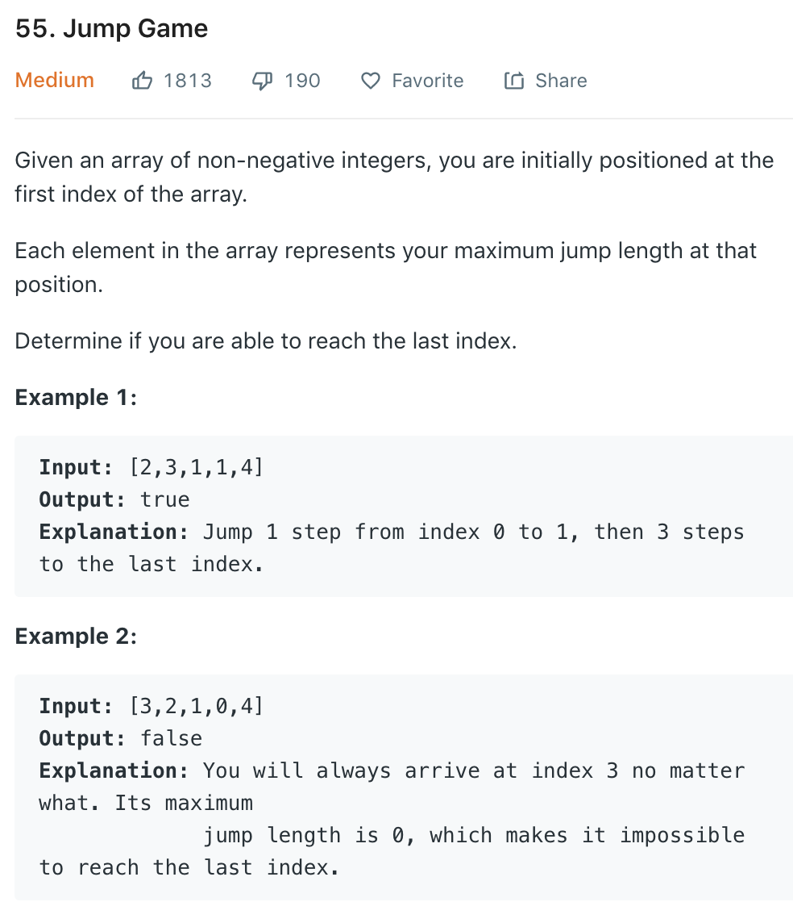

我一看这题目标题就知道是一道dp（捂脸）。。。所有的dp问题都可以先想出一个recursion解法，然后再化成iterative的dp就可以了。

如果是单纯的recursion的话， 我们从index 0开始，对从目前这个点开始的可以达到的任何一个index进行recursively call就可以了。base case这里是如果我们目前index的值直接大于到最后一个index所需要的距离，我们return true即可。

那我们如何把这个解法化成dp呢？我们建立一个和nums size一样的memo vector来表示在当前index可否到达最后一个index。我们把所有memo中的元素都初始化为`false`，并将最后一个element初始化为`true`。然后我们从倒数第二个element开始向前遍历。这里需要考虑两种情况：
1. 如果我们当前index的值大于到最后index所需要的距离，我们把`memo[index]`改成`true`。
2. 我们写一个loop来遍历从目前这个index一直到当前index所能直接到达的所有点，也就是(index 到 index + nums[index])，如果在这区间内的memo有任何一个是`true`，我们就知道memo[index]也是`true`了。

看一下c++的实现：

```cpp
class Solution {
public:
    bool canJump(vector<int>& nums) {
        vector<bool> memo(nums.size(), false);
        memo[memo.size() - 1] = true;
        for (int i = nums.size() - 2; i >= 0; --i) {
            if (nums[i] >= nums.size() - i - 1) {
                memo[i] = true;
                continue;
            } 
            for (int j = i; j <= (i + nums[i]); ++j)
                if (memo[j]) {
                    memo[i] = true;
                    break;
                }
        }
        return memo[0];
    }
```

提交以后发现在倒数第二个test case超时了。。。很难受。左思右想没有想到优化，就看了一下答案，发现其实我们不用从最后一个向前遍历，其实从头向后遍历即可。我们需要一个`distance`变量来记录我们目前为止所能跳到的最远的点，然后一直向后遍历并update `distance`即可。如果在某一个点我们update `distance`之后，`distance`还是等于`i`，说明我们无法前进到下一个index了，所以我们return `false`即可。

```cpp
class Solution {
public:
    bool canJump(vector<int>& nums) {
        int distance = 0;
        for (int i = 0; i < nums.size() - 1; ++i) {
            distance = max(distance, i + nums[i]);
            if (distance == i)
                return false;
        }
        return true;
    }
};
```

这个解法时间复杂度为$O(N)$，空间复杂度为$O(1)$。代码也是简洁明了。

###总结

有的时候其实不要太局限于自己对题目的第一印象。这道题我就是有一个先入为主的思想，感觉这题一定是用dp做，导致自己并没有能跳出这个思维定式，从而并没有想出最优解。