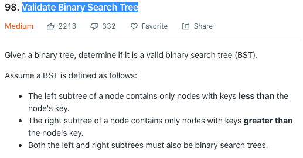

怠惰了一整个暑假。。这几天要赶秋招了，赶紧开始紧密的刷题，不能再落下了。一个暑假过去感觉自己之前刷的题全部忘光了，所以先从相对简单的题目做起。

题目描述如下：


这道题目乍一看相当简单，仿佛只需要确认left和right child都是validBST，再确认左右child都分别小于大于当前node的val就可以了。但是这个方法有一个问题：假设我们有如下的BST，

```
 5
|  \
2    7
| \  | \
1  3 4  9
```

我们的算法在得到这个tree时是会返回true的，但是这并不是一个valid的bst。我们可以看到在右侧的4是小于root 5的，所以应该严格的在这个bst的左子树上，但是右子树自己是一个valid BST。所以我们上面所描述的算法不成立。

### Key Takeaway
我们可以换一个思路来想这个问题：

>BST有什么特性呢？如果我们有一个合法的bst，那在对它进行in-order traversal时，我们会得到一个完全排好升序的数组。如果在想到这个的前提下做这道题就会变得容易很多。

### 思路

想要check一个BST是否valid，我们可以对它进行in-order-traversal。如果我们traverse到一个node，它的val小于或等于traverse的前一个node val时，那它就不是一个valid bst。有了思路以后我们来看一下代码：

```cpp
/**
 * Definition for a binary tree node.
 * struct TreeNode {
 *     int val;
 *     TreeNode *left;
 *     TreeNode *right;
 *     TreeNode(int x) : val(x), left(NULL), right(NULL) {}
 * };
 */
class Solution {
public:
    isValidBST(TreeNode* root) {
        TreeNode* prev = nullptr;
        return inOrderTraversal(root, prev);
    }

private:
    inOrderTraversal(TreeNode* node, TreeNode* &prev) {
        if (!node)
            return true;
        if (!inOrderTraversal(node->left, prev))
            return false;
        if (prev && prev->val >= node->val)
            return false;
        
        prev = node;
        return inOrderTraversal(node->right, prev);
    }
}
```

写一个`inOrderTravesal`的helper method来帮助我们遍历bst。除此之外，我们需要一个`prev`指针来保存当前node的前一个node。遍历过程中，我们只需要保持in-order的顺序，并一直比较`prev`和`node`的val，且遍历完一个node之后update一下`prev`为当前node即可。