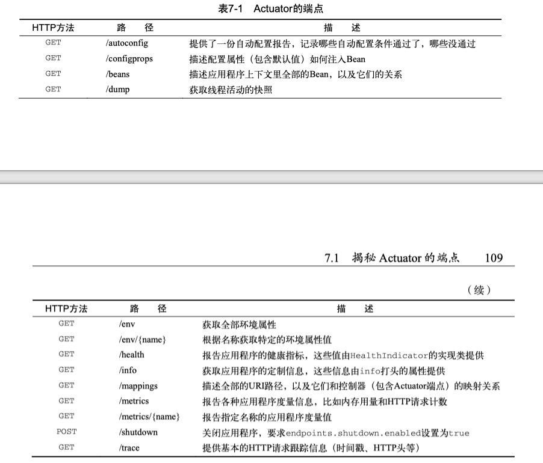

## 自定义安全配置

在maven中加入spring security的起步依赖后，我们可以通过配置来覆盖掉一些默认属性。

```java
@Configuration
@EnableWebSecurity
public class SecurityConfig extends WebSecurityConfigurerAdapter {

    @Autowired
    private ReaderRepository readerRepository;

    @Override
    protected void configure(HttpSecurity http) throws Exception {
        http
            .authorizeRequests()
                .antMatchers("/").access("hasRole('READER')")
                .antMathcers("/**").permitAll()
            
            .and()

            .formLogin()
                .loginPage("/login") /* 设置登录表单的路径 */
                .failureUrl("/login?error=true");
    }

    @Override
    protected void configure(
                AuthenticationManagerBuilder auth) throws Exception {
        auth
            .userDetailsService(new UserDetailsService() {
                @Override
                public UserDetails loadUserByUserName(String username)
                    throws UsernameNotFoundException {
                        return readerRepository.findOne(username);
                    }
            });
    }
}
```

## 通过属性文件外置配置

1. 使用命令行参数：
```sh
java  -jar readinglist.jar --spring.main.show-banner=false
```

2. 使用`application.properties`来配置:
```
spring.main.show-banner=false
```

3. 使用`application.yml`来配置:
```yml
spring:
    main:
        show-banner: false
```

4. 使用环境变量
```sh
export spring_main_show_banner=false
```

### 配置数据源

In your `application.yml`:
```yml
spring:
    datasource:
        url: jdbc:mysql://localhost/readinglist
        username: dbuser
        password: dbpass
```

### Bean配置外置

如何为何系统级变量？举个例子，如果我们想manage一个链接名称，我们可以用`@ConfigurationProperties`注解来将其注入至需要使用它的class中。

```java
@Controller
@RequestMapping("/")
@ConfigurationProperties(prefix = "amazon")
public class ReadingListController() {

    private String associateId;

    public void setAssociateId(String associateId) {
        this.associateId = associateId;
    }
}
```

在我们的`application.yml`中：
```yml
amazon:
    associateId: chenxiao
```

此法有一个问题，就是他将此Controller设置为了amazon作为属性前缀，显然是不合理的。另一种方法是我们建立一个单独的Bean来保存所有的属性。

```java
// AmazonProperties.java

@Component
@ConfigurationProperties("amazon") // 注入带amazon前缀的所有属性
public class AmazonProperties {
    
    @Getter @Setter // lombok
    private String associateId;
}
```

在我们的controller中：

```java
@Controller
public class ReadingListController {

    @Autowired
    private ReadingListRepository readingListRepository;
    @Autowired
    private AmazonProperties amazonProperties;

    // to use associateId, use `amazonProperties.getAssociateId();`
}
```


### 更改应用Profile

我们可以使用`@Profile`注解来标识是否apply configuration。比如，我们的securityconfig：

```java
@Profile("production")
public class SecurityConfig /*...*/
```

在命令行中：

```sh
java -jar readinglist.jar --spring.profiles.active=production
```

## Spring测试

### 测试web安全

在测试类中：
```java
@Before
public void setUpMockMvc() {
    mockMvc = MockMvcBuilders
        .webAppContextSetup(webContext)
        .apply(sprintSecurity())
        .build();
}

@Test
@WithMockUser(username="Chenxiao", password="password", role="READER")
public void homePage_authenticatedUser() throws Exception {
    ...
}
```


## 基于Groovy的Spring Boot CLI应用

1. CLI可以里哟名Spring Boot的自动配置和起步依赖。
2. CLI可以检测到正在使用的特定类，自动解析合适的依赖库来支持那些类。
3. CLI知道多数常用类都在哪些包里，如果用到了这些类，他会把那些包加入Groovy的默认包中。
4. 检测到是Web App后，CLI会自动引入嵌入式Web容器。

### 管理dependencies

可以在根目录下建立一个`Grabs.groovy`来将所有的grab语句都放在这里。

```groovy
@Grab("h2")
@Grab("spring-boot-starter-thymeleaf")
class Grabs {}
```

## Actuator的使用方法



### 连接actuator的远程shell
加入remote shell的起步依赖以后：

```sh
ssh user@localhost -p 2000
Password authentication 
Password:
```

可使用一下命令：
```
autoconfig
beans
endpoint
metrics
```

可以使用`endpoint list`来获取所有可用端点。如果要调用，比如`health`端点，可使用：

```sh
spring invoke health
```

### 重命名端点

在`application.yml`中：
```yml
endpoints:
    shutdown:
        id: kill
```

### 启用和禁用端点

```yml
endpoints:
    metrics:
        enabled: false
```

也可将大部分disable掉，而只打开特定几个：

```yml
endpoints:
    enabled: false
    metrics:
        enabled: true
```

### 保护actuator端点

在SecurityConfig中：
```java
// ...
http
    .authorizeRequests()
        .antMatchers("/shutdown").access("hasRole('ADMIN')")
// ...
```

所有的actuator默认是在根路径下，但是我们也可以改变他：

```yml
management:
    context-path: /mgmt
```

这样，我们的shutdown就变为`/mgmt/shutdown`了。

## 部署Spring Boot应用程序

### 打包为uber jar

使用maven的话，我们直接在命令行运行：
```sh
mvn package
```

spring会将我们的应用程序打包为一个jar包并放置在/target目录下。

如果要生成war文件，则我们需要在`pom.xml`中加入：

```xml
<packaging>war</packaging>
```

### 数据库迁移

#### Flyway

我们将当前版本的sql脚本放入/db/migration目录下。需要注意的是，flyway会检测我们脚本的命名。遵循如下的定律：

```
V2_initialize.sql
```

必须以大写的V开头，下划线后为描述当前migration的语句。

#### Liquibase

和flyway不同的是，liquibase需要使用yml来定义数据库迁移。


