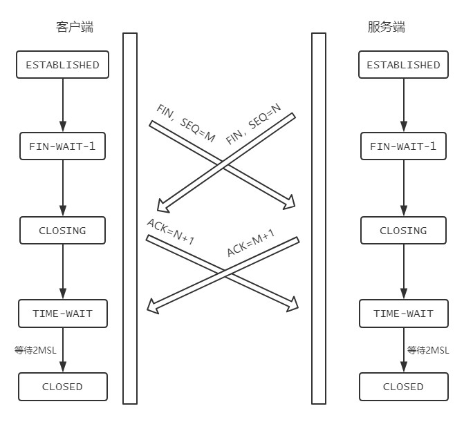
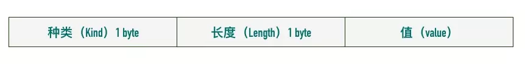
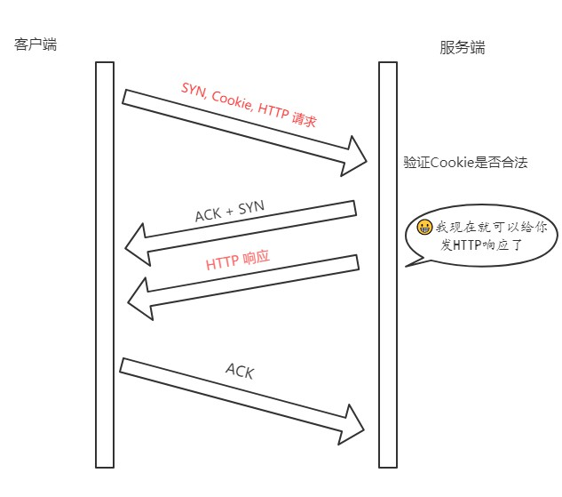
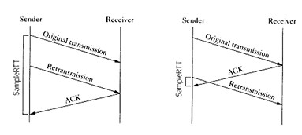

# 001. 能不能说一说 TCP 和 UDP 的区别？
首先概括一下基本的区别:

TCP是一个面向连接的、可靠的、基于字节流的传输层协议。

而UDP是一个面向无连接的传输层协议。(就这么简单，其它TCP的特性也就没有了)。

具体来分析，和 UDP 相比，TCP 有三大核心特性:

面向连接。所谓的连接，指的是客户端和服务器的连接，在双方互相通信之前，TCP 需要三次握手建立连接，而 UDP 没有相应建立连接的过程。

可靠性。TCP 花了非常多的功夫保证连接的可靠，这个可靠性体现在哪些方面呢？一个是有状态，另一个是可控制。

TCP 会精准记录哪些数据发送了，哪些数据被对方接收了，哪些没有被接收到，而且保证数据包按序到达，不允许半点差错。这是有状态。

当意识到丢包了或者网络环境不佳，TCP 会根据具体情况调整自己的行为，控制自己的发送速度或者重发。这是可控制。

相应的，UDP 就是无状态, 不可控的。

面向字节流。UDP 的数据传输是基于数据报的，这是因为仅仅只是继承了 IP 层的特性，而 TCP 为了维护状态，将一个个 IP 包变成了字节流。

# 说说 TCP 三次握手的过程？为什么是三次而不是两次、四次？

## 恋爱模拟

以谈恋爱为例，两个人能够在一起最重要的事情是首先确认各自爱和被爱的能力。接下来我们以此来模拟三次握手的过程。

第一次:

男: **我爱你。**

女方收到。

由此证明男方拥有`爱`的能力。

第二次:

女: **我收到了你的爱，我也爱你。**

男方收到。

OK，现在的情况说明，女方拥有**爱**和**被爱**的能力。

第三次:

男: **我收到了你的爱。**

女方收到。

现在能够保证男方具备**被爱**的能力。

由此完整地确认了双方**爱**和**被爱**的能力，两人开始一段甜蜜的爱情。

## 真实握手

当然刚刚那段属于扯淡，不代表本人价值观，目的是让大家理解整个握手过程的意义，因为两个过程非常相似。对应到 TCP 的三次握手，也是需要确认双方的两样能力: **发送的能力**和**接收的能力**。于是便会有下面的三次握手的过程:


从最开始双方都处于`CLOSED`状态。然后服务端开始监听某个端口，进入了`LISTEN`状态。

然后客户端主动发起连接，发送 `SYN` , 自己变成了`SYN-SENT`状态。

服务端接收到，返回`SYN`和`ACK`(对应客户端发来的`SYN`)，自己变成了`SYN-RCVD`。

之后客户端再发送`ACK`给服务端，自己变成了`ESTABLISHED`状态；服务端收到`ACK`之后，也变成了`ESTABLISHED`状态。

另外需要提醒你注意的是，从图中可以看出，`SYN`是需要消耗一个序列号的，下次发送对应的`ACK`序列号要加1，为什么呢？只需要记住一个规则:

> 凡是需要对端确认的，一定消耗TCP报文的序列号。

SYN 需要对端的确认， 而 ACK 并不需要，因此 SYN 消耗一个序列号而 ACK 不需要。

## 为什么不是两次？

根本原因: 无法确认客户端的接收能力。

分析如下:

如果是两次，你现在发了 SYN 报文想握手，但是这个包滞留在了当前的网络中迟迟没有到达，TCP 以为这是丢了包，于是重传，两次握手建立好了连接。

看似没有问题，但是连接关闭后，如果这个滞留在网路中的包到达了服务端呢？这时候由于是两次握手，服务端只要接收到然后发送相应的数据包，就默认建立连接，但是现在客户端已经断开了。

看到问题的吧，这就带来了连接资源的浪费。

## 为什么不是四次？

三次握手的目的是确认双方`发送`和`接收`的能力，那四次握手可以嘛？

当然可以，100 次都可以。但为了解决问题，三次就足够了，再多用处就不大了。

## 三次握手过程中可以携带数据么？

第三次握手的时候，可以携带。前两次握手不能携带数据。

如果前两次握手能够携带数据，那么一旦有人想攻击服务器，那么他只需要在第一次握手中的 SYN 报文中放大量数据，那么服务器势必会消耗更多的时间和内存空间去处理这些数据，增大了服务器被攻击的风险。

第三次握手的时候，客户端已经处于`ESTABLISHED`状态，并且已经能够确认服务器的接收、发送能力正常，这个时候相对安全了，可以携带数据。

## 同时打开会怎样？

如果双方同时发 `SYN`报文，状态变化会是怎样的呢？

这是一个可能会发生的情况。

状态变迁如下:


在发送方给接收方发SYN报文的同时，接收方也给发送方发SYN报文，两个人刚上了!

发完SYN，两者的状态都变为SYN-SENT。

在各自收到对方的SYN后，两者状态都变为SYN-RCVD。

接着会回复对应的ACK + SYN，这个报文在对方接收之后，两者状态一起变为ESTABLISHED。

这就是同时打开情况下的状态变迁。

# 003: 说说 TCP 四次挥手的过程

## 过程拆解


刚开始双方处于`ESTABLISHED`状态。

客户端要断开了，向服务器发送 `FIN` 报文，在 TCP 报文中的位置如下图:


发送后客户端变成了`FIN-WAIT-1`状态。注意, 这时候客户端同时也变成了`half-close(半关闭)`状态，即无法向服务端发送报文，只能接收。

服务端接收后向客户端确认，变成了`CLOSED-WAIT`状态。

客户端接收到了服务端的确认，变成了`FIN-WAIT2`状态。

随后，服务端向客户端发送`FIN`，自己进入`LAST-ACK`状态，

客户端收到服务端发来的FIN后，自己变成了`TIME-WAIT`状态，然后发送`ACK`给服务端。

注意了，这个时候，客户端需要等待足够长的时间，具体来说，是 2 个 MSL(Maximum Segment Lifetime，报文最大生存时间), 在这段时间内如果客户端没有收到服务端的重发请求，那么表示 ACK 成功到达，挥手结束，否则客户端重发 ACK。

## 等待2MSL的意义

如果不等待会怎样？

如果不等待，客户端直接跑路，当服务端还有很多数据包要给客户端发，且还在路上的时候，若客户端的端口此时刚好被新的应用占用，那么就接收到了无用数据包，造成数据包混乱。所以，最保险的做法是等服务器发来的数据包都死翘翘再启动新的应用。

那，照这样说一个 MSL 不就不够了吗，为什么要等待 2 MSL?

* 1 个 MSL 确保四次挥手中主动关闭方最后的 ACK 报文最终能达到对端
* 1 个 MSL 确保对端没有收到 ACK 重传的 FIN 报文可以到达

这就是等待 2MSL 的意义。

## 同时关闭会怎样？

如果客户端和服务端同时发送 FIN ，状态会如何变化？如图所示:



# 004: 说说半连接队列和 SYN Flood 攻击的关系

三次握手前，服务端的状态从`CLOSED`变为`LISTEN`, 同时在内部创建了两个队列：**半连接队列**和**全连接队列**，即**SYN队列**和**ACCEPT队列**。

## 半连接队列

当客户端发送`SYN`到服务端，服务端收到以后回复`ACK`和`SYN`，状态由`LISTEN`变为`SYN_RCVD`，此时这个连接就被推入了`SYN`队列，也就是**半连接队列**。

## 全连接队列

当客户端返回`ACK`, 服务端接收后，三次握手完成。这个时候连接等待被具体的应用取走，在被取走之前，它会被推入另外一个 TCP 维护的队列，也就是全连接队列(Accept Queue)。

## SYN Flood 攻击原理

SYN Flood 属于典型的 DoS/DDoS 攻击。其攻击的原理很简单，就是用客户端在短时间内伪造大量不存在的 IP 地址，并向服务端疯狂发送SYN。对于服务端而言，会产生两个危险的后果:

1. 处理大量的SYN包并返回对应ACK, 势必有大量连接处于SYN_RCVD状态，从而占满整个半连接队列，无法处理正常的请求。
2. 由于是不存在的 IP，服务端长时间收不到客户端的ACK，会导致服务端不断重发数据，直到耗尽服务端的资源。

## 如何应对 SYN Flood 攻击？

1. 增加 SYN 连接，也就是增加半连接队列的容量。
2. 减少 SYN + ACK 重试次数，避免大量的超时重发。
3. 利用 SYN Cookie 技术，在服务端接收到SYN后不立即分配连接资源，而是根据这个SYN计算出一个Cookie，连同第二次握手回复给客户端，在客户端回复ACK的时候带上这个Cookie值，服务端验证 Cookie 合法之后才分配连接资源。

# 005: 介绍一下 TCP 报文头部的字段

报文头部结构如下(单位为字节):


请大家牢记这张图！

## 源端口、目标端口

如何标识唯一标识一个连接？答案是 TCP 连接的四元组——源 IP、源端口、目标 IP 和目标端口。

那 TCP 报文怎么没有源 IP 和目标 IP 呢？这是因为在 IP 层就已经处理了 IP 。TCP 只需要记录两者的端口即可。

## 序列号

即Sequence number, 指的是本报文段第一个字节的序列号。

从图中可以看出，序列号是一个长为 4 个字节，也就是 32 位的无符号整数，表示范围为 0 ~ 2^32 - 1。如果到达最大值了后就循环到0。

序列号在 TCP 通信的过程中有两个作用:

1. 在 SYN 报文中交换彼此的初始序列号。
2. 保证数据包按正确的顺序组装。

## ISN 

即Initial Sequence Number（初始序列号）,在三次握手的过程当中，双方会用过SYN报文来交换彼此的 ISN。

ISN 并不是一个固定的值，而是每 4 ms 加一，溢出则回到 0，这个算法使得猜测 ISN 变得很困难。那为什么要这么做？

如果 ISN 被攻击者预测到，要知道源 IP 和源端口号都是很容易伪造的，当攻击者猜测 ISN 之后，直接伪造一个 RST 后，就可以强制连接关闭的，这是非常危险的。

而动态增长的 ISN 大大提高了猜测 ISN 的难度。

## 确认号

即ACK(Acknowledgment number)。用来告知对方下一个期望接收的序列号，小于ACK的所有字节已经全部收到。

## 标记位

常见的标记位有SYN,ACK,FIN,RST,PSH。

SYN 和 ACK 已经在上文说过，后三个解释如下: FIN： 即 Finish，表示发送方准备断开连接。

RST：即 Reset，用来强制断开连接。

PSH： 即 Push, 告知对方这些数据包收到后应该马上交给上层的应用，不能缓存。

## 窗口大小

占用两个字节，也就是 16 位，但实际上是不够用的。因此 TCP 引入了窗口缩放的选项，作为窗口缩放的比例因子，这个比例因子的范围在 0 ~ 14，比例因子可以将窗口的值扩大为原来的 2 ^ n 次方。

## 校验和

占用两个字节，防止传输过程中数据包有损坏，如果遇到校验和有差错的报文，TCP 直接丢弃之，等待重传。

## 可选项

可选项的格式如下:



常用的可选项有以下几个:

* TimeStamp: TCP 时间戳，后面详细介绍。
* MSS: 指的是 TCP 允许的从对方接收的最大报文段。
* SACK: 选择确认选项。
* Window Scale： 窗口缩放选项。

# 006: 说说 TCP 快速打开的原理(TFO)

第一节讲了 TCP 三次握手，可能有人会说，每次都三次握手好麻烦呀！能不能优化一点？

可以啊。今天来说说这个优化后的 TCP 握手流程，也就是 TCP 快速打开(TCP Fast Open, 即TFO)的原理。

优化的过程是这样的，还记得我们说 SYN Flood 攻击时提到的 SYN Cookie 吗？这个 Cookie 可不是浏览器的Cookie, 用它同样可以实现 TFO。

## TFO 流程

### 首轮三次握手

首先客户端发送SYN给服务端，服务端接收到。

注意哦！现在服务端不是立刻回复 SYN + ACK，而是通过计算得到一个SYN Cookie, 将这个Cookie放到 TCP 报文的 Fast Open选项中，然后才给客户端返回。

客户端拿到这个 Cookie 的值缓存下来。后面正常完成三次握手。

首轮三次握手就是这样的流程。而后面的三次握手就不一样啦！

### 后面的三次握手

在后面的三次握手中，客户端会将之前缓存的 Cookie、SYN 和HTTP请求(是的，你没看错)发送给服务端，服务端验证了 Cookie 的合法性，如果不合法直接丢弃；如果是合法的，那么就正常返回SYN + ACK。

重点来了，现在服务端能向客户端发 HTTP 响应了！这是最显著的改变，三次握手还没建立，仅仅验证了 Cookie 的合法性，就可以返回 HTTP 响应了。

当然，客户端的ACK还得正常传过来，不然怎么叫三次握手嘛。

流程如下:



注意: 客户端最后握手的 ACK 不一定要等到服务端的 HTTP 响应到达才发送，两个过程没有任何关系。

### TFO 的优势

TFO 的优势并不在与首轮三次握手，而在于后面的握手，在拿到客户端的 Cookie 并验证通过以后，可以直接返回 HTTP 响应，充分利用了1 个RTT(Round-Trip Time，往返时延)的时间提前进行数据传输，积累起来还是一个比较大的优势。

# 007: 能不能说说TCP报文中时间戳的作用？

`timestamp`是 TCP 报文首部的一个可选项，一共占 10 个字节，格式如下:

```
kind(1 字节) + length(1 字节) + info(8 个字节)
```

其中 kind = 8， length = 10， info 有两部分构成: timestamp和timestamp echo，各占 4 个字节。

那么这些字段都是干嘛的呢？它们用来解决那些问题？

接下来我们就来一一梳理，TCP 的时间戳主要解决两大问题:

* 计算往返时延 RTT(Round-Trip Time)
* 防止序列号的回绕问题

## 计算往返时延 RTT

在没有时间戳的时候，计算 RTT 会遇到的问题如下图所示:



如果以第一次发包为开始时间的话，就会出现左图的问题，RTT 明显偏大，开始时间应该采用第二次的；

如果以第二次发包为开始时间的话，就会导致右图的问题，RTT 明显偏小，开始时间应该采用第一次发包的。

实际上无论开始时间以第一次发包还是第二次发包为准，都是不准确的。

那这个时候引入时间戳就很好的解决了这个问题。

比如现在 a 向 b 发送一个报文 s1，b 向 a 回复一个含 ACK 的报文 s2 那么：

* step 1: a 向 b 发送的时候，timestamp 中存放的内容就是 a 主机发送时的内核时刻 ta1。
* step 2: b 向 a 回复 s2 报文的时候，timestamp 中存放的是 b 主机的时刻 tb, timestamp echo字段为从 s1 报文中解析出来的 ta1。
* step 3: a 收到 b 的 s2 报文之后，此时 a 主机的内核时刻是 ta2, 而在 s2 报文中的 timestamp echo 选项中可以得到 ta1, 也就是 s2 对应的报文最初的发送时刻。然后直接采用 ta2 - ta1 就得到了 RTT 的值。

## 防止序列号回绕问题

现在我们来模拟一下这个问题。

序列号的范围其实是在0 ~ 2 ^ 32 - 1, 为了方便演示，我们缩小一下这个区间，假设范围是 0 ~ 4，那么到达 4 的时候会回到 0。

| 第几次发包 | 发送字节 | 对应序列号 |           状态          |
|:----------:|:--------:|:----------:|:-----------------------:|
| 1          | 0 ~ 1    | 0 ~ 1      | 成功接收                |
| 2          | 1 ~ 2    | 1 ~ 2      | 滞留在网络中            |
| 3          | 2 ~ 3    | 2 ~ 3      | 成功接收                |
| 4          | 3 ~ 4    | 3 ~ 4      | 成功接收                |
| 5          | 4 ~ 5    | 0 ~ 1      | 成功接收，序列号从0开始 |
| 6          | 5 ~ 6    | 1 ~ 2      | ？？？                  |

假设在第 6 次的时候，之前还滞留在网路中的包回来了，那么就有两个序列号为1 ~ 2的数据包了，怎么区分谁是谁呢？这个时候就产生了序列号回绕的问题。

那么用 timestamp 就能很好地解决这个问题，因为每次发包的时候都是将发包机器当时的内核时间记录在报文中，那么两次发包序列号即使相同，时间戳也不可能相同，这样就能够区分开两个数据包了。

# 008: TCP 的超时重传时间是如何计算的？

TCP 具有超时重传机制，即间隔一段时间没有等到数据包的回复时，重传这个数据包。

那么这个重传间隔是如何来计算的呢？

今天我们就来讨论一下这个问题。

这个重传间隔也叫做**超时重传时间(Retransmission TimeOut, 简称RTO)**，它的计算跟上一节提到的 RTT 密切相关。这里我们将介绍两种主要的方法，一个是经典方法，一个是标准方法。

## 经典方法

经典方法引入了一个新的概念——SRTT(Smoothed round trip time，即平滑往返时间)，没产生一次新的 RTT. 就根据一定的算法对 SRTT 进行更新，具体而言，计算方式如下(SRTT 初始值为0):

```py
SRTT =  (α * SRTT) + ((1 - α) * RTT)
```

其中，α 是**平滑因子**，建议值是0.8，范围是0.8 ~ 0.9。

拿到 SRTT，我们就可以计算 RTO 的值了:

```py
RTO = min(ubound, max(lbound, β * SRTT))
```

β 是加权因子，一般为1.3 ~ 2.0， lbound 是下界，ubound 是上界。

其实这个算法过程还是很简单的，但是也存在一定的局限，就是在 RTT 稳定的地方表现还可以，而在 RTT 变化较大的地方就不行了，因为平滑因子 α 的范围是0.8 ~ 0.9, RTT 对于 RTO 的影响太小。

## 标准方法

为了解决经典方法对于 RTT 变化不敏感的问题，后面又引出了标准方法，也叫`Jacobson / Karels`算法。

一共有三步。

第一步: 计算SRTT，公式如下:

```py
SRTT = (1 - α) * SRTT + α * RTT
```

注意这个时候的 α跟经典方法中的α取值不一样了，建议值是1/8，也就是0.125。

第二步: 计算RTTVAR(round-trip time variation)这个中间变量。

```py
RTTVAR = (1 - β) * RTTVAR + β * (|RTT - SRTT|)
```

β 建议值为 0.25。这个值是这个算法中出彩的地方，也就是说，它记录了最新的 RTT 与当前 SRTT 之间的差值，给我们在后续感知到 RTT 的变化提供了抓手。

第三步: 计算最终的RTO:

```py
RTO = µ * SRTT + ∂ * RTTVAR 
```

µ建议值取1, ∂建议值取4。

这个公式在 SRTT 的基础上加上了最新 RTT 与它的偏移，从而很好的感知了 RTT 的变化，这种算法下，RTO 与 RTT 变化的差值关系更加密切。

# 009: 能不能说一说 TCP 的流量控制？

对于发送端和接收端而言，TCP 需要把发送的数据放到发送缓存区, 将接收的数据放到接收缓存区。

而流量控制索要做的事情，就是在通过接收缓存区的大小，控制发送端的发送。如果对方的接收缓存区满了，就不能再继续发送了。

要具体理解流量控制，首先需要了解滑动窗口的概念。

## TCP 滑动窗口

TCP 滑动窗口分为两种: 发送窗口和接收窗口。

### 发送窗口

发送端的滑动窗口结构如下:


其中包含四大部分:

* 已发送且已确认
* 已发送但未确认
* 未发送但可以发送
* 未发送也不可以发送

其中有一些重要的概念，我标注在图中:


发送窗口就是图中被框住的范围。SND 即send, WND 即window, UNA 即unacknowledged, 表示未被确认，NXT 即next, 表示下一个发送的位置。

### 接收窗口

接收端的窗口结构如下:


REV 即 receive，NXT 表示下一个接收的位置，WND 表示接收窗口大小。

### 流量控制过程

这里我们不用太复杂的例子，以一个最简单的来回来模拟一下流量控制的过程，方便大家理解。

首先双方三次握手，初始化各自的窗口大小，均为 200 个字节。

假如当前发送端给接收端发送 100 个字节，那么此时对于发送端而言，SND.NXT 当然要右移 100 个字节，也就是说当前的可用窗口减少了 100 个字节，这很好理解。

现在这 100 个到达了接收端，被放到接收端的缓冲队列中。不过此时由于大量负载的原因，接收端处理不了这么多字节，只能处理 40 个字节，剩下的 60 个字节被留在了缓冲队列中。

注意了，此时接收端的情况是处理能力不够用啦，你发送端给我少发点，所以此时接收端的接收窗口应该缩小，具体来说，缩小 60 个字节，由 200 个字节变成了 140 字节，因为缓冲队列还有 60 个字节没被应用拿走。

因此，接收端会在 ACK 的报文首部带上缩小后的滑动窗口 140 字节，发送端对应地调整发送窗口的大小为 140 个字节。

此时对于发送端而言，已经发送且确认的部分增加 40 字节，也就是 SND.UNA 右移 40 个字节，同时发送窗口缩小为 140 个字节。

这也就是流量控制的过程。尽管回合再多，整个控制的过程和原理是一样的。